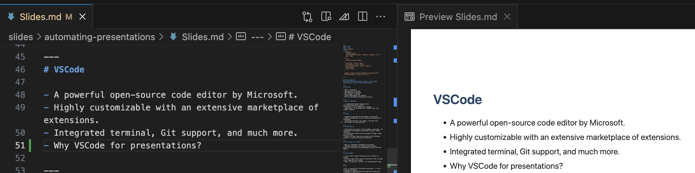

<!-- backgroundColor: #de1a76 -->
<!-- color: #fff -->

## Naim Gkamperlo
### Automating Presentation Creation with VSCode, Marp, GitHub Pages and GPT

---
# Overview

- What is Markdown?
- Introduction to VSCode
- Devcontainers Explained
- Marp Plugin for VSCode
- Using GitHub Pages for Hosting
- GPT for Automated Presentation Creation

---
# What is Markdown?

- A lightweight markup language with plain-text-formatting syntax.
- Designed for easy reading and writing.
- Used widely for documentation, README files, and content creation.

---
# VSCode

- A powerful open-source code editor by Microsoft.
- Highly customizable with an extensive marketplace of extensions.
- Integrated terminal, Git support, and much more.
- Why VSCode for presentations? 
---

---
# Markdown in VSCode

- Markdown files can be edited and previewed directly in VSCode.
- Supports various extensions to enhance Markdown editing experience.
---
# Creating Presentation with Marp

- Simple syntax for slide separation and styling.
- Preview slides real-time in VSCode.
---
# Marp Plugin for VSCode

- Marp is a Markdown presentation ecosystem.
- The Marp extension for VSCode allows creating beautiful slide decks using Markdown directly from the editor.

---
# GitHub Pages

- A **free** static website hosting service offered by GitHub.
- Directly takes HTML, CSS and JavaScript files straight from a repository on GitHub.
- Ideal for personal, project, or organizational sites.

---

# GPT

- GPT, or Generative Pretrained Transformer, is an AI developed by OpenAI.
- Capable of understanding and generating human-like text based on prompts.
- Can be leveraged for automated content creation.
- Why GPT? to create a base for our presentation in a markdown output.

---
# Automating with GPT

- Use GPT to automatically generate presentation content.
- Can be trained on specific data for customized output.

---
# The Integration Process 🧪

1. GPT: to create marp markdown basis of the presentation
2. VSCode + Marp: Iterate on the output to achieve **greatness** 👑
3. Output the presentation with Marp plugin to preferred format (pptx, pdf, html)
4. Publish on GitHub Pages/Share
5. [Optional] Export to pptx for additional refinement

---
# Publishing to GitHub Pages

- Push the HTML generated by Marp to a GitHub repo.
- Automatically hosted by GitHub Pages.

---

# Conclusion

- The combination of VSCode, Marp, GitHub Pages, and GPT creates a powerful, automated, and free solution for presentation creation.
- Allows for streamlined, repeatable, and high-quality presentations.
- Give it a try
  <i class="fa-brands fa-github"></i> GitHub: [Link](https://github.com/ngkamperlo/presentations/automating-presentations)

--- 

# Thank you for your attention 🙇‍♂️
