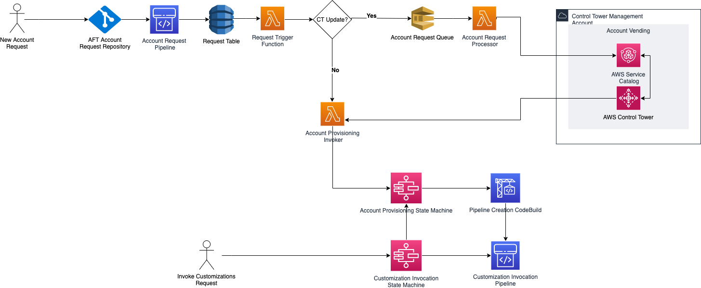

### Thanos Kataras - Global GCP Cloud Engineering Lead **@ Mondelẽz** 

<i class="fa-brands fa-linkedin"></i> &nbsp; [https://www.linkedin.com/in/athanasios-kataras-b9384440/)](https://www.linkedin.com/in/athanasios-kataras-b9384440/)
<i class="fa-brands fa-github"></i> &nbsp; [https://github.com/thanos-kataras](https://github.com/thanos-kataras)

### Naim Gkamperlo - Cloud Engineering Lead Europe **@ Mondelẽz** 

<i class="fa-brands fa-linkedin"></i> &nbsp; [https://linkedin.com/in/ngkamperlo](https://linkedin.com/in/ngkamperlo)
<i class="fa fa-window-maximize"></i> &nbsp; [https://medium.com/ngkamperlo](https://medium.com/ngkamperlo)
<i class="fa-brands fa-github"></i> &nbsp; [https://github.com/ngkamperlo](https://github.com/ngkamperlo)

Naim's book on MFEs 🤘

Presentation

---

# Hands-Free Account Creation: Zero Clicks with AWS AFT

## Agenda

1. **Introduction to AWS AFT**
2. **AFT Architecture Overview**
3. **Terraform Integration with AFT**
4. **Account Factory Workflow**
5. **High-Level Points & Best Practices**

---

# Introduction to AWS AFT

### What is AWS AFT?

- **Initially AWS Landing Zone** AWS Landing Zone helped the users to setup multi account AWS environment with all the recommended best practices.
- **Later rebranded to AWS Control Tower** along with additional features - It provides a central management of multi account AWS organization.
- **AWS Control Tower does not come with an API** - a need was created to automate the whole process using IaC.
- **AWS Account Factory for Terraform (AFT)** automates the provisioning and management of AWS accounts.
- **Goal**: Enable **hands-free** account creation, management, and governance at scale using IaC.

---

# AWS Control Tower

- Automates setup of a **landing zone** for multi-account AWS environments.
- Centralized **identity management** for all accounts using AWS SSO.
- **Centralized logging** for CloudTrail and Config, directed to a logging account.
- **Guardrails** for preventive and detective controls applied to governed accounts.
- **Account Factory** for standardized, pre-approved account configurations.
- **Dashboard** enables administrators to:
  - View provisioned accounts across the enterprise.
  - Monitor controls for **policy enforcement**.
  - Detect policy **non-compliance** across accounts and OUs.
  - Organize noncompliant resources by account and organizational unit.

---

# Benefits of AWS AFT

### Why Use AWS AFT?

- **Zero Touch**: Automates account provisioning and account lifecycle management.
- **Governance at Scale**: Ensures each account follows organizational standards.
- **Security & Compliance**: Implements consistent security guardrails and controls across all accounts.

---

# AFT Architecture Overview

### Key Components

- **AWS Control Tower**: Manages landing zones and enforces governance.
- **Account Vending Machine (AVM)**: Automates account provisioning.
- **Customizations**: Lambda functions allow custom validation and configuration.

---

---

# Core Services in AFT

### Services Supporting AFT

- **Lambda**: Runs custom code to extend account creation workflows.
- **SNS & SQS**: Event-driven messaging to trigger and monitor account provisioning.
- **DynamoDB**: Stores metadata on account configurations and status.

---

# Terraform Integration with AFT

### Terraform Overview

- **Terraform**: Infrastructure as Code (IaC) tool that simplifies cloud resource management.
- **AFT Module**: A specific module to integrate Terraform with AWS Account Factory.

---

# Benefits of Terraform with AFT

### Terraform Advantages

- **Consistency**: Ensures that all accounts are provisioned with the same configurations.
- **Modularity**: Easily adjust configurations for different accounts or environments.
- **Scalability**: Handle account creation across multiple regions and teams efficiently.

---

# Account Factory Workflow

### Steps of Account Creation

1. **Trigger Account Request**: Initiated by Terraform configuration.
2. **Validation**: Lambda functions validate account settings before creation.
3. **Provision Account**: The AVM provisions accounts automatically.
4. **Customization**: Apply custom configurations (policies, tags, etc.).
5. **Monitor Compliance**: Use AWS Config and Lambda to enforce rules.

---

# Custom Workflows in AFT

### Customization Opportunities

- **Lambda Functions**: Extend validation or apply additional account settings.
- **Event-Driven Logic**: Use SNS and SQS to handle notifications and trigger additional processes.
- **Policy Management**: Apply custom IAM policies or compliance frameworks.

---

# AWS AFT Repositories Overview

1. **Account Request Repository (aft-account-request)** Main repository for Terraform account templates to trigger account provisioning workflows.
2. **Global Customizations (aft-global-customizations)** Applies standard resources or settings globally across all accounts.
3. **Account-Specific Customizations (aft-account-customizations)** Customize individual accounts based on organization needs.
4. **Provisioning Customizations (aft-account-provisioning-customizations)** Hooks into the account vending process to apply specific configurations during account setup.

---

# High-Level Points & Best Practices

### Key Takeaways

- **Automation**: Eliminate manual effort in account creation and governance.
- **Security & Governance**: Implement consistent security and compliance controls.
- **Customizable**: Adapt workflows using Terraform, Lambda, and SNS for organizational needs.

---

# Thank You! 🫶
