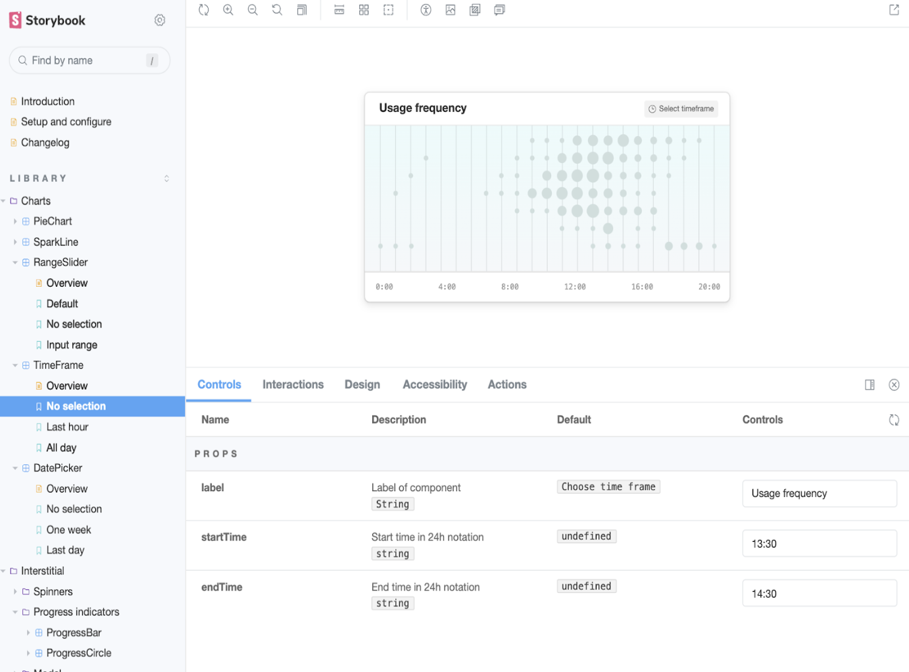

## Naim Gkamperlo AD of engineering @**GWI** 

<i class="fa-brands">𝕏</i> &nbsp; [@ngkamperlo](https://x.com/ngkamperlo)
<i class="fa-brands fa-linkedin"></i> &nbsp; [https://linkedin.com/in/ngkamperlo](https://linkedin.com/in/ngkamperlo)
<i class="fa fa-window-maximize"></i> &nbsp; [https://medium.com/ngkamperlo](https://medium.com/ngkamperlo)
<i class="fa-brands fa-github"></i> &nbsp; [https://github.com/ngkamperlo](https://github.com/ngkamperlo)

My book on MFEs 🤘

Presentation

---

### **Honey, I Shrunk the UI**
#### ***Adventures in Microfrontends***

---

<!-- _backgroundColor: #dedad2 -->

# Le Agenda

- Small intro
- Routing
- Common components aka Cross-framework Components
- MFE Versioning
- MFE Communication
- Bonus #1 - Slicing the elephant
- Bonus #2 - Breaking the monolith
- Bonus #3 - Organizational strategies

---

<!-- _backgroundColor: #54bebe -->

# Small intro to Microfrontends

- Microfrontends allow an application to be split into smaller applications.
- Each application, or "microfrontend" (MFE), can be developed and deployed independently.
- Host/Kernel/Platform/Shell is the app that glues all of the MFEs together
- This approach reduces the complexity and risk associated with large, monolithic frontends.
  - Smaller codebase: easier to understand and maintain.
  - Scalability: Teams can work on different microfrontends simultaneously.
  - Independence: Allows use of different technologies in each MFE.

---
<!-- _backgroundColor: #54bebe -->

# Problem #1 - Routing

---
<!-- _backgroundColor: #76c8c8 -->

## Routing in Microfrontends
Microfrontends routing can be implemented in various ways
- routing in the host
- routing in the microfrontends themselves
- combination of both etc

---

<!-- _backgroundColor: #98d1d1 -->

## Routing Solution - Client-side routing
- Implemented a two-level routing strategy: combination of routing
  - in the host and
  - in the MFE level
- Can use libraries like React Router or Vue Router to manage routing within your application.

---
<!-- _backgroundColor: #badbdb -->

## First-Level Routing (Routing in the Host)
- Host manages navigation between different microfrontends.
- The host application is responsible for managing the navigation and returning a 404 page if a MFE doesn't exist.

---
<!-- _backgroundColor: #dedad2 -->

## Second-Level Routing (Routing in the Microfrontends)
- Each MFE is responsible for handling its own navigation.
- Second level routing should be handled independently within each microfrontend to ensure that each microfrontend remains autonomous
- ***Caveat*** 🚨: All MFEs should handle browser navigation errors (4xx) in the same way

---

---
<!-- _backgroundColor: #e4bcad -->

# Problem #2 
# *Common components with logic*
*aka Cross-framework Components*
*aka Shared Components*
*aka*
*aka*
*r-**aka**-makafon* 😂🎤

---

<!-- _backgroundColor: #e4bcad -->

# Problem #2 
# *Common components with logic*
*aka Cross-framework Components*
*aka Shared Components*
*aka*
*aka*
*r-**aka**-makafon* 😂🎤

---
<!-- _backgroundColor: #df979e -->

# Common components with logic

- Components that work across different frameworks.
  - In GWI: Elm and React-based applications
- Examples: widgets, modals, pop-ups

---
<!-- _backgroundColor: #c80064 -->
# Common components - Solution

- We decided to implement the functionality once
  - either in React or Elm
  - wrap the output in web components

---

<!-- _backgroundColor: #d7658b -->

# MFE - Web component communication
- The MFE transmits data to the common component through its **HTML attributes**
- The MFE retrieves data from the common component using the **browser’s custom events**

---

# Pros and cons of web component wrapped elements

- ✅
  - saved time as most components were written already
  - single repo to develop common components
- 🛑
  - Introduced complexity
    - Serialization/Deserialization of complex JSON objects 
  - Complex CI/CD pipelines
  - No static type checking (lack of tsc utilization)
  - No WYSIWYG functionality

---

<!-- _backgroundColor: #df979e -->
# Enter Storybook

## Benefits

1. Quick Development
   1. WYSIWYG
   2. Test out stuff before merging to MFEs
2. Stay Updated
3. Better Communication

--- 

<!-- _backgroundColor: #e4bcad -->
# Problem #3
# *MFE Versioning*

---

<!-- _backgroundColor: #e4bcad -->
# Problem #3 - MFE Versioning

We needed to connect the host with MFEs in a way that MFEs:

- Can be updated easily by engineers, designers and PMs
- Using a single tool that is easily maintained by our engineers
- With versions that are instantly uncached in all environments
- We decided to approach the above in an agile way i.e small iterations, inspect and adapt. 

---

<!-- _backgroundColor: #dedad2 -->
# MFE Versioning - Solution
- The result of our approach is an internal tool called `FE-Configuration` or `MFE tool`.
- MFE tool features
  1. Ability to create MFE applications along with their corresponding MFEs.
  2. Ability to easily update MFEs regardless the environment.
  3. Scalable FE UI developed with React and BE with dedicated microservice. 🙏
  4. Latest versions per MFE for easy rollback 
  5. Maintenance mode per MFE/application
  6. Support for Feature Branches

---

<!-- _backgroundColor: #badbdb -->
# MFE Versioning - Support for feature branches the GWI way
*“The core idea behind the Feature Branch Workflow is that all feature development should take place in a dedicated branch instead of the main branch.” - Atlassian*

But better…
- Match feature branch code to a specific UI 
- Deploy in any environment
- Accessible with a dedicated URL 
- e.g. `https://{GWI_PLATFORM_URL}/{feature branch name}/{mfe name}`
- Ability to work on the same feature in multiple MFEs
- Super scalable

---

<!-- _backgroundColor: #98d1d1 -->
# Problem #4
# *MFE Communication*

---

<!-- _backgroundColor: #76c8c8 -->
# MFE Communication

- Unfortunately (😂), MFEs need to communicate with each other for a cohesive user experience.
- We managed to delay the implementation of MFE communication for 2.5 years 😛

--- 
<!-- _backgroundColor: #54bebe -->
# Possible MFE communication methods
The most common methods include:

- Using props
- Using platform storage APIs
- Using message channels
- Utilizing the host as an event bus
- Utilization of more than a single pattern

---

# MFE Communication - Solution specific to GWI's infra: `Shared state`
In GWI we utilized a shared state mechanism as follows:
1. Predefined actions in a shared library
2. Those actions are responsible for navigating to another MFE with a `predetermined payload`
3. We try to restrict MFE communication as much as possible: `its a wannabe bug generator` 🐛

---
<!-- _backgroundColor: #76c8c8 -->

## Bonus #1 - Slicing the Elephant

***Important***: We are not actually slicing an elephant (sorry for dad joke 😛)

Various MFE Slicing/Splitting Techniques:

- **Vertical Slicing/Domain-driven Slicing:** 
  - Based on business domains/subdomains
  - Each domain gets its own independent microfrontend
- **Horizontal Slicing:** 
  - Splitting microfrontends based on application layers.
  - Separate microfrontends for the UI layer, menu, and sidebar.
- **Hybrid Slicing:** Utilizes both vertical and horizontal splitting techniques.
- **Islands Architecture:** Renders HTML pages on the server, with placeholders for highly dynamic regions.
- **Component Slicing:** 
  - The application is split based on components.
  - Most granular approach to microfrontends.

---
<!-- _backgroundColor: #98d1d1 -->

# Vertical Slicing

- Divides application based on domains.
- Results in **self-contained** microfrontends handling specific parts of the application.
- Promotes better separation of concerns.
- Enables teams to work independently on different features.
- Key aspects:
  - Utilise 2 level routing to manage navigation between different microfrontends
  - Use of common components across different MFEs for UI consistency and code deduplication.

---
<!-- _backgroundColor: #badbdb -->

# Horizontal Slicing: Layers & Functionalities Based Splitting

- Divides application into MFEs based on layers or functionalities.
- Can include separating UI components, headers, footers, sidebars, etc.
- Benefits:
  - Improved code maintainability.
  - Each team can work independently on their area of expertise
- Challenges:
  - Increased complexity in coordinating and integrating different layers.
  - Risk of creating "silos" within the application
- In some cases, hybrid slicing might be the most suitable approach.

---
<!-- _backgroundColor: #dedad2 -->

# Bonus #2 
## Breaking the Monolith

- Breaking down a monolithic application into microfrontends
- A monolithic application usually is a single-page application that is built as a single codebase.

---
<!-- _backgroundColor: #e4bcad -->

# Breaking the Monolith - Identifying microfrontends
1. Domain boundaries
2. Component dependencies
3. Team structure

---
<!-- _backgroundColor: #df979e -->

# Breaking the Monolith
1. It is important to start with the most complex or frequently changing parts of the application
   1. tackle the most complex challenges upfront
   2. identify potential issues and roadblocks early on
   3. Do this only if you have a dedicated team and vision for the success of the project
2. Consider the
   1. impact on your development teams and 
   2. how they will be reorganized/restructured to better align with the new architecture.

---
<!-- _backgroundColor: #d7658b -->

# Bonus #3
## Organizational Strategies - Cross Functional Teams

- Allows the team to tackle complex problems and deliver high-quality solutions more efficiently.
- Cross-functional teams also enable greater flexibility and adaptability.
- If you use microservices for your BE
  - Consider adopting the Backends For Frontends (BFF) architecture to enhance teams' autonomy.

---
<!-- _backgroundColor: #c80064 -->
# Organizational Strategies - Domain-driven Design
- DDD can help teams to better understand the boundaries between different parts of the system
- DDD can be applied to microfrontends by 
  - designing microfrontends around `aggregates`
  - using `domain events` for communication
  - implementing `repositories` as communication with the BE for data access.

---

# Thank You! 🤘
# Naim Gkamperlo

<i class="fa-brands">𝕏</i> &nbsp; [@ngkamperlo](https://x.com/ngkamperlo)
<i class="fa-brands fa-linkedin"></i> &nbsp; [https://linkedin.com/in/ngkamperlo](https://linkedin.com/in/ngkamperlo)
<i class="fa fa-window-maximize"></i> &nbsp; [https://medium.com/ngkamperlo](https://medium.com/ngkamperlo)
<i class="fa-brands fa-github"></i> &nbsp; [https://github.com/ngkamperlo](https://github.com/ngkamperlo)

My book on MFEs 🤘

Presentation

