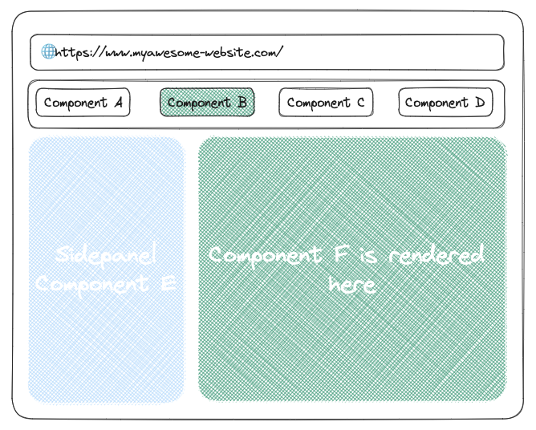

# TypeScript Foundations

---

# What is TypeScript?

TypeScript is an open-source language which builds on JavaScript by adding static type definitions.

---

# Why TypeScript?

- Predictability
- Readability
- Tooling and community
- Enhanced development experience
- Improved maintainability and scalability

---

# TypeScript vs. JavaScript

JavaScript is dynamically typed, meaning the type is checked during execution. TypeScript is statically typed, meaning type checking is done during compile time.

---

# Setting up TypeScript

1. Install Node.js and npm
2. Install TypeScript globally: `npm install -g typescript`
3. Compile .ts to .js: `tsc myfile.ts`

---

# TypeScript Configuration

You can control the TypeScript compiler options using a special file called `tsconfig.json`.

---

# Basic Types in TypeScript

1. Boolean
2. Number
3. String
4. Array
5. Tuple
6. Enum
7. Any
8. Void
9. Null and Undefined
10. Never

--- 
# Boolean

The most basic datatype is the simple true/false value, which JavaScript and TypeScript call a `boolean`.

```typescript
let isDone: boolean = false;
```
--- 
# Number
As in JavaScript, all numbers in TypeScript are floating point values.

```typescript

let decimal: number = 6;
let hex: number = 0xf00d;
let binary: number = 0b1010;
let octal: number = 0o744;
```
--- 
# String
Another fundamental part of creating programs in JavaScript for webpages and servers alike is working with textual data.

```typescript

let color: string = "blue";
color = 'red';
```

--- 
# Array
TypeScript, like JavaScript, allows you to work with arrays of values.

```typescript

let list: number[] = [1, 2, 3];
let list: Array<number> = [1, 2, 3]; // another way
```

--- 
# Tuple
Tuple types allow you to express an array with a fixed number of elements whose types are known.

```typescript

let x: [string, number];
x = ["hello", 10]; // OK
x = [10, "hello"]; // Error
```

--- 
# Enum
A helpful addition to the standard set of datatypes from JavaScript is the enum.

```typescript

enum Color {
    Red,
    Green,
    Blue
}
let c: Color = Color.Green;
```

--- 
# Any
We may need to describe the type of variables that we do not know when we are writing an application.

```typescript

let notSure: any = 4;
notSure = "maybe a string instead";
notSure = false; // okay, definitely a boolean
```

--- 
# Void
void is a little like the opposite of any: the absence of having any type at all.

```typescript

function warnUser(): void {
    console.log("This is my warning message");
}
```

--- 
# Null and Undefined
Much like JavaScript, TypeScript has null and undefined as possible values for any type.

```typescript

let u: undefined = undefined;
let n: null = null;
```

--- 
# Never
The never type represents the type of values that never occur.

```typescript

function error(message: string): never {
    throw new Error(message);
}
```
---
# Function Types
Interfaces can also describe function types.

```typescript

interface SearchFunc {
    (source: string, subString: string): boolean;
}
```

--- 
# Classes in TypeScript
TypeScript includes full support for classes, as in object-oriented programming.

```typescript

class Greeter {
    greeting: string;
    constructor(message: string) {
        this.greeting = message;
    }
    greet() {
        return "Hello, " + this.greeting;
    }
}
```

--- 
# Public, private, and protected modifiers
Each member is public by default. You can also mark members as private or protected.

--- 
# Union Types
Union types are a powerful way to express a variable with multiple types.

```typescript

function padLeft(value: string, padding: string | number) {
    //...
}
```

--- 
# Type Guards and Differentiating Types
A common idiom in JavaScript to differentiate between two possible values.

```typescript

function isFish(pet: Fish | Bird): pet is Fish {
    return (pet as Fish).swim !== undefined;
}
```

--- 
# Type Aliases
Type aliases create a new name for a type.

```typescript

type StringOrNumber = string | number;

```
--- 
# Advanced Typescript
---
# Interfaces

_Interfaces are powerful ways to define contracts within your code_

```typescript
interface Animal {
  name: string;
  makeSound(): void;
}
```
---

# Defining a Contract
```typescript

class Dog implements Animal {
  name = "Dog";
  
  makeSound() {
    console.log('Bark');
  }
}
```

---

# Optional Properties in Interfaces
Interfaces can have optional properties, marked with a '?‘.

```typescript

interface Employee {
  name: string;
  age?: number;
}
```
---

# Readonly Properties
Properties can be marked as readonly for variables that should not be changed

```typescript

interface Config {
  readonly path: string;
  readonly timeout: number;
}
```
---

# Extending Interfaces
Interfaces can be extended

```typescript

interface Bird extends Animal {
  fly(): void;
}
```
---

# Generics
Generics provide a way to make components work with any data type

```typescript

function identity<T>(arg: T): T {
  return arg;
}
```
---

# Working with Generic Variables
```typescript

function loggingIdentity<T>(arg: T[]): T[] {
  console.log(arg.length);
  return arg;
}
```
---

# Decorators
Decorators provide a way to add both annotations and a meta-programming syntax for class declarations and members

```typescript

function sealed(target) {
  Object.seal(target);
  Object.seal(target.prototype);
}
```

---
# Sealed example
The code above does the following:
1. The @sealed decorator applies Object.seal to the constructor and the prototype of the Greeter class.
2. Object.seal prevents adding or deleting properties to an object. It also marks all existing properties as non-configurable. Values of present properties can still be changed as long as they are writable.
3. It can be used in the following manner
---
```ts
@sealed
class Greeter {
    greeting: string;
    constructor(message: string) {
        this.greeting = message;
    }
    greet() {
        return "Hello, " + this.greeting;
    }
}
```
---

# Modules
Modules are executed within their own scope, not in the global scope

```typescript
import { ZipCodeValidator } from "./ZipCodeValidator";
```
---

# Export
Exporting a declaration

```typescript
export interface ZipCodeValidator {
  isAcceptable(s: string): boolean;
}
```
and as seen in previous example
```typescript
import { ZipCodeValidator } from './ZipCodeValidator'
```
---

# Default exports
Each module can optionally export a default export

```typescript
export default class ZipCodeValidator {
  // Class logic
}
```
and in another file in the same folder
```typescript
import ZipCodeArubaBahamaJamaica from './ZipCodeValidator'
```
*Disclaimer*: When importing default exported variable you can name it as you'd like

---

# Merging Namespaces with Classes, Functions, and Enums
```typescript
namespace Album {
  export class AlbumLabel { 
    .
    .
    .
  }
}
class Album {
  label: Album.AlbumLabel = new Album.AlbumLabel();
}
```
---

# Advanced Types
Partial Types

```typescript
interface Todo {
  title: string;
  description: string;
}

function updateTodoDescription(todo: Todo, fieldsToUpdate: Partial<Todo>) {
  todo.description = fieldsToUpdate.description;
}
```
---

# Conditional Types
```typescript

type TypeName<T> = 
  T extends string ? "string" :
  T extends number ? "number" :
  T extends boolean ? "boolean" :
  T extends undefined ? "undefined" :
  "object";
```
---

# Using Third Party Libraries
Type declarations

```typescript

import * as Lodash from "lodash";
```
---

# Module Augmentation
You can add your own functions to existing third party modules

```typescript

declare module "lodash" {
  interface LoDashStatic {
    myFunction(param: number): void;
  }
}
```
---
# **React**
---
# Introduction to **React**
- JavaScript library for building user interfaces
- Developed by Facebook - 1st release *May 29th, 2013*
- Component-based architecture
---
# Why use React?
- Declarative: Make your code more predictable and easier to debug
- Component-Based: Encapsulated components that manage their own state
- Learn Once, Write Anywhere: You can develop new features without rewriting existing code
---



---
# React Foundations
React Hello World!

```jsx
import React from 'react';
import ReactDOM from 'react-dom';

function HelloWorld() {
  return <h1>Hello, world!</h1>;
}

ReactDOM.render(<HelloWorld />, document.getElementById('root'));
```
---

# Core React concepts

--- 

# JSX

JavaScript XML (JSX) - Syntax extension for JavaScript
Looks like HTML, but it's JavaScript
JSX elements are treated as JavaScript expressions
```tsx
const element = <h1>Hello, world!</h1>;
```
--- 

# Components
Components let you split the UI into independent, reusable pieces
Two types of components: Functional and Class components
```typescript
// Functional component
function Welcome(props) {
  return <h1>Hello, {props.name}</h1>;
}

// Class component
class Welcome extends React.Component {
  render() {
    return <h1>Hello, {this.props.name}</h1>;
  }
}
```

--- 

# Props
*props (which stands for properties - no shit Sherlock 🧐😂)*
- way to pass data from parent to child components
```typescript
function Welcome(props) {
  return <h1>Hello, {props.name}</h1>;
}

const element = <Welcome name="John" />;
```

--- 

# State & Lifecycle

State - Similar to props but private and fully controlled by the component
Lifecycle methods - special methods in the component level to run code at particular times in the process

---

```typescript
class Clock extends React.Component {
  constructor(props) {
    super(props);
    this.state = {date: new Date()};
  }

  componentDidMount() {
    this.timerID = setInterval(
      () => this.tick(),
      1000
    );
  }

  tick() {
    this.setState({
      date: new Date()
    });
  }

  render() {
    return (
      <div>
        <h1>Hello, world!</h1>
        <h2>It is {this.state.date.toLocaleTimeString()}.</h2>
      </div>
    );
  }
}
```

--- 

# Hooks
Hooks let you use state and other React features without writing a class component. 
Essentially its an addition that came with React Functional Components and introduced in **React 16.8**

---

```typescript
import React, { useState } from 'react';

function Example() {
  const [count, setCount] = useState(0);

  return (
    <div>
      <p>You clicked {count} times</p>
      <button onClick={() => setCount(count + 1)}>
        Click me
      </button>
    </div>
  );
}
```

--- 
# Class Components with TypeScript
TypeScript can be used with React to ensure type safety in your React code.

```tsx
import React, { Component } from 'react';

interface WelcomeProps {
  name: string;
}

class Welcome extends Component<WelcomeProps> {
  render() {
    return <h1>Hello, {this.props.name}</h1>;
  }
}

export default Welcome;
```
--- 
# Stateful Function[al] Components with TypeScript
TypeScript provides static types to ensure type safety in your React function components.

```tsx
import React, { useState } from 'react';

const Counter: React.FC = () => {
  const [count, setCount] = useState<number>(0);
  return (
    <div>
      <p>You clicked {count} times</p>
      <button onClick={() => setCount(count + 1)}>
        Click me
      </button>
    </div>
  );
}

export default Counter;
```
--- 

# One-Way Data Flow with TypeScript
Use TypeScript with React to ensure type safety in one-way data flow.

```tsx
import React from 'react';

interface ChildProps {
  name: string;
}

const ChildComponent: React.FC<ChildProps> = (props) => {
  return <h1>Hello, {props.name}</h1>;
}

const ParentComponent: React.FC = () => {
  return <ChildComponent name="Sara" />;
}

export default ParentComponent;
```
--- 
# Modern JavaScript Features Used With React
Understanding modern JavaScript features such as 
- new var: `let` & `const`
- rest and spread operator
- destructuring 
- arrow functions 
- default parameters
- modules
- ternary operator
- null coalescing
can help write better React code.

---

# New Variables: `let` & `const`

```ts
let name = 'John';
name = 'Jane'; // Allowed

const age = 30;
age = 31; // Error: Assignment to constant variable.
```
---

# Rest & Spread Operator
```typescript
// Spread
const numbers = [1, 2, 3];
const moreNumbers = [...numbers, 4, 5];

// Rest
function sum(...args) {
  return args.reduce((total, current) => total + current, 0);
}

sum(1, 2, 3); // Returns 6
```
---
# Destructuring
```typescript
const person = {
  firstName: 'John',
  lastName: 'Taramas',
  age: 30
};

const { firstName, age } = person;
```

---

# Arrow functions
```ts
function add(a, b) {return a + b};
// is the same as
const add = (a, b) => a + b;

add(3, 5); // Returns 8
```
```jsx
import React from 'react';

function Welcome({ name }) {
  return <h1>Hello, {name}</h1>;
}

const App = () => <Welcome name="Sara" />;

export default App;
```
--- 
# Default Parameters

```typescript
function introduce(name = "John Doe") {
  return `Hello, my name is ${name}`;
}

introduce(); // Returns "Hello, my name is John Doe"
```
---
# Modules
```typescript
// math.js
export const add = (a, b) => a + b;

// main.js
import { add } from './math';

console.log(add(1, 2)); // Outputs 3
```
--- 

# Ternary operator
```typescript
const x = 10;
const y = 20;
const z = x > y ? x : y;
console.log(z); // Outputs 20
```
---

# Null coalescing operator
Null coalescing operator (??) is a logical operator that returns its right-hand side operand when its left-hand side operand is null or undefined, and otherwise returns its left-hand side operand.
```typescript
const foo = null ?? 'default string';
console.log(foo);
// expected output: "default string"
```

--- 

# Analysis of Core React Tasks
Understanding React's core tasks such as 
- rendering elements
- handling events
- and conditional rendering.
---
```jsx
import React from 'react';

function ToggleButton() {
  const [isToggleOn, setToggle] = useState(true);

  const handleClick = () => {
    setToggle(!isToggleOn);
  }

  //rendering element
  return (
    //handling events
    <button onClick={handleClick}>
      //conditional rendering
      {isToggleOn ? 'ON' : 'OFF'}
    </button>
  );
}

export default ToggleButton;
```
--- 
# Core React Tasks with TypeScript
TypeScript enhances React's core tasks with static type checks.

```tsx
import React, { useState } from 'react';

const ToggleButton: React.FC = () => {
  //static type check of isToggleOn type of value (boolean)
  const [isToggleOn, setToggle] = useState<boolean>(true);

  const handleClick = () => {
    setToggle(!isToggleOn);
  }

  //rendering element
  return (
    //handling events
    <button onClick={handleClick}>
      //conditional rendering
      {isToggleOn ? 'ON' : 'OFF'}
    </button>
  );
}

export default ToggleButton;
```
---
# More Advanced Uses of TypeScript with React
We can use TypeScript with React to define complex types, interfaces and generics.

---
```tsx
import React, { useState } from 'react';

//interfaces
interface CounterProps {
  initialCount: number;
}

//generics
const Counter: React.FC<CounterProps> = ({ initialCount }) => {
  const [count, setCount] = useState<number>(initialCount);
  return (
    //complex return types
    <div>
      <p>You clicked {count} times</p>
      <button onClick={() => setCount(count + 1)}>
        Click me
      </button>
    </div>
  );
}

export default Counter;
```
---

# Best Practices for Designing Components and Managing State
- organize components into a hierarchy
- keep components small and focused
- lift state up if multiple components need access to it || use a global store
---
```tsx
import React, { useState } from 'react';

interface CounterProps {
  initialCount: number;
  onCountChange: (count: number) => void;
}

const Counter: React.FC<CounterProps> = ({ initialCount, onCountChange }) => {
  const [count, setCount] = useState<number>(initialCount);
  
  const handleClick = () => {
    const newCount = count + 1;
    setCount(newCount);
    onCountChange(newCount);
  };

  return (
    <div>
      <p>You clicked {count} times</p>
      <button onClick={handleClick}>
        Click me
      </button>
    </div>
  );
}

export default Counter;
```
---
# Exploring More of React's Core Tasks
- list rendering

```tsx
import React, { useState } from 'react';

const ListComponent: React.FC = () => {
  const [items] = useState<Array<string>>(['Apple', 'Banana', 'Cherry']);

  return (
    <ul>
      {items.map((item: string, index: number) => <li key={index}>{item}</li>)}
    </ul>
  );
}

export default ListComponent;
```
---
# Exploring More of React's Core Tasks
- handling events with React

```tsx
import React, { useState } from 'react';

interface TextWithParagraphComponentProps {
  initialText: string;
}

const TextWithParagraphComponent: React.FC<TextWithParagraphComponentProps> = ({ initialText }) => {
  const [text, setText] = useState<string>(initialText);

  const handleChange = (event: React.ChangeEvent<HTMLInputElement>) => {
    setText(event.target.value);
  };

  return (
    <div>
      <input type="text" value={text} onChange={handleChange} />
      <p>{text}</p>
    </div>
  );
};

export default TextWithParagraph;

```
---
# Exploring More of React's Core Tasks
- conditional rendering

```tsx
import React, { useState } from 'react';

interface ListComponentProps{
  items: string[];
}
const ListComponent: React.FC<ListComponentProps> = ({items}) => {

  return items.length > 0 ? (
    <ul>
      {items.map((item, index) => <li key={index}>{item}</li>)}
    </ul>
  ) : 
  (<div>The list has no items</div>);
}

export default ListComponent;
```
---
# Deep Diving into React's Lifecycle Methods
React's lifecycle methods give control over different phases of a component's life: 
- mounting
- updating
- unmounting

---

```tsx
import React, { Component } from 'react';

interface Props {
  message: string;
}

class LifecycleComponent extends Component<Props> {
  componentDidMount() {
    console.log('Component did mount');
  }

  componentDidUpdate(prevProps: Props) {
    if (prevProps.message !== this.props.message) {
      console.log('Component did update');
    }
  }

  componentWillUnmount() {
    console.log('Component will unmount');
  }

  render() {
    return <h1>{this.props.message}</h1>;
  }
}

export default LifecycleComponent;
```
---
# The same but with functional components and hooks

```tsx
import React, { useEffect } from 'react';

interface Props {
  message: string;
}

const LifecycleComponent: React.FC<Props> = ({ message }) => {
  useEffect(() => {
    console.log('Component did mount');
    
    return () => {
      console.log('Component will unmount');
    };
  }, []);

  useEffect(() => {
    console.log('Component did update');
  }, [message]);

  return <h1>{message}</h1>;
};

export default LifecycleComponent;
```
---
# Discussing Performance Optimization Techniques
React's built-in optimizations like PureComponent and memo can be leveraged for better performance.

```tsx
import React, { memo } from 'react';

interface Props {
  message: string;
}

const MemoComponent: React.FC<Props> = memo(({ message }) => {
  return <h1>{message}</h1>;
});

export default MemoComponent;
```
---

# Implementing Routing
React Router can be used to manage routing in your application.

---

```tsx
import React from 'react';
import { BrowserRouter as Router, Route, Link } from 'react-router-dom';

const HomePage: React.FC = () => <h1>Home Page</h1>;
const AboutPage: React.FC = () => <h1>About Page</h1>;

const App: React.FC = () => {
  return (
    <Router>
      <nav>
        <ul>
          <li>
            <Link to="/">Home</Link>
          </li>
          <li>
            <Link to="/about">About</Link>
          </li>
        </ul>
      </nav>

      <Route path="/" exact component={HomePage} />
      <Route path="/about" component={AboutPage} />
    </Router>
  );
}

export default App;
```
---
# Designing Forms and Handling Form Events
React provides controlled components to handle form inputs and events.
- React hook form
- Formik
---

```tsx
import React, { useState } from 'react';

const FormComponent: React.FC = () => {
  const [name, setName] = useState<string>('');

  const handleChange = (event: React.ChangeEvent<HTMLInputElement>) => {
    setName(event.target.value);
  };

  const handleSubmit = (event: React.FormEvent<HTMLFormElement>) => {
    event.preventDefault();
    alert(`Submitted name: ${name}`);
  };

  return (
    <form onSubmit={handleSubmit}>
      <label>
        Name:
        <input type="text" value={name} onChange={handleChange} />
      </label>
      <input type="submit" value="Submit" />
    </form>
  );
}

export default FormComponent;
```
---
# Using External Libraries and APIs with React and TypeScript
You can use external libraries like Axios for making HTTP requests and integrate APIs into your React application.

--- 

```tsx
import React, { useState, useEffect } from 'react';
import axios from 'axios';

interface User {
  id: number;
  name: string;
  email: string;
}

const UserComponent: React.FC = () => {
  const [users, setUsers] = useState<Array<User>>([]);

  useEffect(() => {
    axios.get('https://jsonplaceholder.typicode.com/users')
      .then(response => setUsers(response.data))
      .catch(error => console.error(error));
  }, []);

  return (
    <ul>
      {users.map(user => (
        <li key={user.id}>{user.name} ({user.email})</li>
      ))}
    </ul>
  );
}

export default UserComponent;
```

--- 
Thank you 🤘