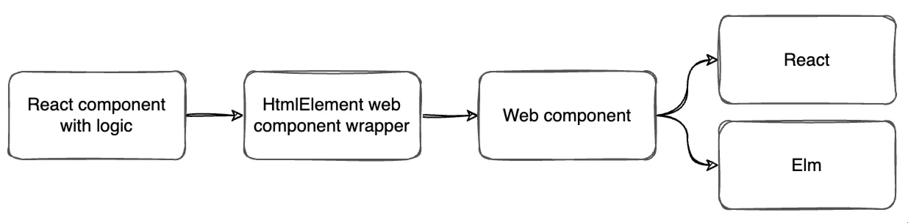
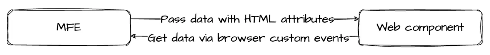

## Naim Gkamperlo
### Associate Director of Engineering **GWI** 

<i class="fa-brands fa-twitter"></i> Twitter: @ngkamperlo
<i class="fa-brands fa-linkedin"></i> LinkedIn: - [https://linkedin.com/in/ngkamperlo](https://linkedin.com/in/ngkamperlo)
<i class="fa fa-window-maximize"></i> Blog: [https://medium.com/ngkamperlo](https://medium.com/ngkamperlo)
<i class="fa-brands fa-github"></i> GitHub: [https://github.com/ngkamperlo](https://github.com/ngkamperlo)

---

# Our Journey with Micro-Frontends at GWI

---
# Why Micro-Frontends (MFEs)?

- The ability to scale a codebase easily
- A single team can own a specific MFE, making teams more autonomous
- The risk of using a single new frontend technology can be contained
- Establishes a cadence of deployments for each team
  - Ensures deployments are not dependent on what the other teams do or deploy
- Does your engineering team really need MFEs? [MFE calculator](https://microfrontend.dev/)

--- 

# MFEs at GWI

- The journey with MFEs began in 2019
- Neither the team nor the community had much experience with MFEs in a production environment

---

# We'll discuss the **problems** we faced so far

---

# Problem #1 - MFE Versioning

- Updating an MFE to a new version and making the kernel (aka host) aware of the latest version
  - We didn't need fully automated updates as it could add the wrong versions in production
  - We didn't want a fully manual solution requiring a git commit to update a single MFE

---

## MFE Versioning: The Solution

- Creation of a service (frontend configuration) providing the kernel with the latest version of all MFEs
- A simple UI adding a new version of an MFE and updating all clients with the latest version
- You can find more the details [here](https://www.youtube.com/live/8033GWqjiB0?feature=share&t=7126)

---

# Problem #2 - Single Design System

- There isn't a single design system in place, instead, we have two implementations
- One for the React-based MFEs and another for the Elm-based MFEs

---

## Single Design System: Issues

- Hard to detect UI mismatches
- Changes made to the design system do not bubble up directly to all the MFEs
- Huge effort required to update UI libraries
- Huge effort to be consistent is needed

---

# Problem #3 - Common UI Components with Logic — Web Components

- The problem: MFEs had common pieces of functionality regardless of the technology used
- The solution: Implement functionality only once and wrap the output down to web components

---

## Webcomponents - The problems to the solution

- No component versioning in place
- No typescript compile time error prevention

---

## Webcomponents - Solutions

- Semver implementation
- Communication between component and MFEs by utilizing browser custom events and html attributes
- Store the web components in an internal storybook for everyone to review

---

# Problem #4 - Creating a Single-Page Mini App

- The need to create a single-page mini-app that was too small for a new MFE but too big for a web component

---

## Solution 1: BlackBox Pattern

- A black-box app that communicates with other applications only using custom events and renders and hides from the DOM as needed

---

## Solution 2: Web Component with Its Git Repository

- Due to patterns used in Elm-based apps, we decided to switch everything to `web components`

---

# Problem #5 - MFE Communication

- Communication between MFEs isn't straightforward
- Module federation was introduced with Webpack 5 to make communication between MFEs easier

---

## Shared State Between MFEs

- We currently have a shared state between MFEs which is framework and library agnostic
- We utilize kernel as a service bus to route events between MFEs
  - Blog post is close - stay tuned 🤘

---

# Future Focus Areas

- Module federation
- Updating frontend configuration with enhanced versioning functionality
- Merging together all common components in a single repo

---

# Thank You! 🤘
# Naim Gkamperlo

<i class="fa-brands fa-twitter"></i> Twitter: @ngkamperlo
<i class="fa-brands fa-linkedin"></i> LinkedIn: - [https://linkedin.com/in/ngkamperlo](https://linkedin.com/in/ngkamperlo)
<i class="fa fa-window-maximize"></i> Blog: [https://medium.com/ngkamperlo](https://medium.com/ngkamperlo)
<i class="fa-brands fa-github"></i> GitHub: [https://github.com/ngkamperlo](https://github.com/ngkamperlo)