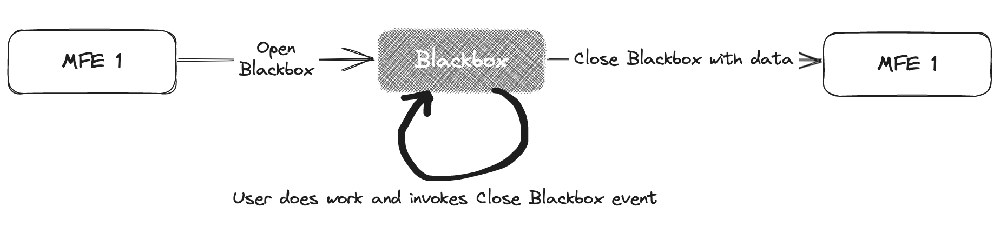

## Naim Gkamperlo
### Associate Director of Engineering **GWI** 

<i class="fa-brands fa-twitter"></i> Twitter: @ngkamperlo
<i class="fa-brands fa-linkedin"></i> LinkedIn: [https://linkedin.com/in/ngkamperlo](https://linkedin.com/in/ngkamperlo)
<i class="fa fa-window-maximize"></i> Blog: [https://medium.com/ngkamperlo](https://medium.com/ngkamperlo)
<i class="fa-brands fa-github"></i> GitHub: [https://github.com/ngkamperlo](https://github.com/ngkamperlo)

[Github repo](https://github.com/ngkamperlo/blackbox)

---

# **Blackbox Pattern**

---

# Creating Blackboxes in Micro-Frontends

- Need: Use shared components in the Micro-Frontend (MFE) architecture.
- What is a Blackbox? 
  - Essentially a standalone ***function*** with a corresponding ***UI***
  - *Small enough* to not be a separate MFE
  - *Complex enough* that needs to be self-contained

---

# The Problem

- Need for reusable components across different MFEs.
- The common practice is to restrict communication between MFEs as much as possible.
- The above resulted in inability to fulfill all product requirements.
- Our specific need in GWI: 
  - a small enough and complex enough component 
  - tied with a UI which can
  - be utilized across multiple MFEs 
  - regardless of their tech stack

---

# Requirements

- The component needs to be invocable by other MFEs and various front end languages.
- It should render itself in the DOM and delete itself once its task is completed.
- Must always provide its latest version to all consumers, ensuring they have the most updated version.
---

# Additional Requirements

- The component should have minimal communication with other MFEs.
- This approach prevents potential issues such as overengineering by 
  - misusing local storage or 
  - utilizing web socket mechanisms.
- Communication only via browser custom events
---

# Initial Solution

- Considered creating another MFE invoked by the host/kernel.
- Problem: This could lead to shared state between MFEs, violating the principle (we had back then) of MFE independence.

---

# Refined Solution

- A MFE with a single input (browser custom event).
- It renders in the DOM within a single element provided by each invoking MFE.
- It communicates results via predefined browser custom events
- It removes itself from the DOM upon completion

---

# Result

- The blackbox can be invoked by any MFE and front end languages.
- It independently renders and deletes itself from the DOM.

---

## Blackbox pattern

---

# Real-world Example

- In a banking app, every MFE (accounts, cards, etc.) needs to interact with the transaction UI.
- Solution: Invoke transaction UI with a single event, process user actions, fire event upon completion with transaction results.

---

# Pros of the Blackbox Pattern

- Simplified management with a single repo for the blackbox.
- Reduces complexity with minimal communication between MFEs.
- Technology agnostic, no restrictions on frontend languages.
- Avoids pollution of local storage and misuse of web socket mechanisms.
---

# Cons of the Blackbox Pattern

- Dependencies might be loaded twice when the same technology is used by the blackbox and the invoking MFE.
  - This duplication can be avoided if every MFE in the project uses the same framework, allowing shared external dependencies.
- Implementing a blackbox for the first time could be quite a complex task
---

# Deep-dive into Blackboxes

- A step-by-step guide using React and Webpack to build a blackbox.
---

# Creating a blackbox with React - Step 1

- Create a React Typescript app using create-react-app.
---

# Creating a blackbox with React - Step 2

- Eject the React app to get access to webpack configurations, allowing custom builds.
---

# Creating a blackbox with React - Step 3

- Create `vanilla.tsx`.
- This file 
  - creates a React renderer for vanilla JS 
  - registers basic React's lifecycle events to browser's `window` object,
  - `listens` to caller MFE’s ‘openBlackbox’ custom event.
---

# Creating a blackbox with React - Step 4

- Create `webpack.vanilla.config.js` to specify entry point and output files and location.
---

# Creating a blackbox with React - Step 5

- Create `build-vanilla.js` to point to the custom webpack configuration.
---

# Creating a blackbox with React - Step 6

- Adjust `tsconfig.json` to suppress any array index errors.
---

# Creating a blackbox with React - Step 7

- Add `build:vanilla` to package.json and run it, this creates the blackbox.
---

# Creating a blackbox with React - Step 8

- Test the blackbox: 
  - Open the URL provided by serve’s output in your browser, 
  - invoke the blackbox from the browser’s console.
---

# Creating a blackbox with React - Step 9

- Implement a custom event in the blackbox for the host MFE to subscribe to.
- This allows the host MFE to listen for updates from the blackbox.
---

# Summary

- The blackbox pattern in Micro-Frontends provides an efficient solution to share components across different MFEs.
- This pattern creates a component that has minimal interaction with other MFEs and operates completely independently.
- Through a step-by-step guide using React and Webpack, we demonstrated how to create such a blackbox.
- The blackbox pattern simplifies shared components management in the MFE architecture.
- **You can find the code [here](https://github.com/ngkamperlo/blackbox)**

---

# Thank You! 🤘
# Naim Gkamperlo

<i class="fa-brands fa-twitter"></i> Twitter: @ngkamperlo
<i class="fa-brands fa-linkedin"></i> LinkedIn: [https://linkedin.com/in/ngkamperlo](https://linkedin.com/in/ngkamperlo)
<i class="fa fa-window-maximize"></i> Blog: [https://medium.com/ngkamperlo](https://medium.com/ngkamperlo)
<i class="fa-brands fa-github"></i> GitHub: [https://github.com/ngkamperlo](https://github.com/ngkamperlo)

[Github repo](https://github.com/ngkamperlo/blackbox)

