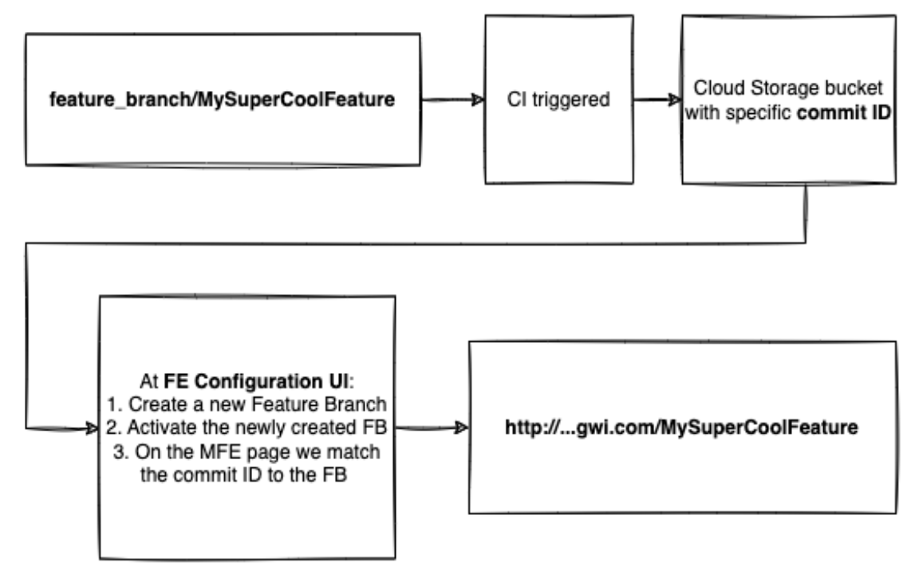

<!-- backgroundColor: #19152f -->
<!-- color: #fff -->

## Naim Gkamperlo
### Associate Director of Engineering **GWI** 

<i class="fa-brands fa-twitter"></i> Twitter: @ngkamperlo
<i class="fa-brands fa-linkedin"></i> LinkedIn: [https://linkedin.com/in/ngkamperlo](https://linkedin.com/in/ngkamperlo)
<i class="fa fa-window-maximize"></i> Blog: [https://medium.com/ngkamperlo](https://medium.com/ngkamperlo)
<i class="fa-brands fa-github"></i> GitHub: [https://github.com/ngkamperlo](https://github.com/ngkamperlo)

My book on MFEs 🤘

Presentation

---

# **Micro-frontend(MFE) versioning**

---

# Terminology 🤓
**Kernel**: (aka shell/platform/host) system that 
1. glues everything i.e 
  *the platform that gets and renders the latest version of each MFE*
2. loads every MFE upon request

**A main branch**: develop, release, master/main git branches
**Application**: result application which includes kernel along with all its MFEs
**BE**: Backend
**CICD**: an automated way to build, test and upload your built code to a predetermined environment
**Environments**: in GWI we have testing, staging and production environments
**FE** Configuration: our tool to keep track of all MFE versions
**GS**: Google Storage
**PR**: Pull Request

---

# MFE versioning
We needed to connect kernel with MFEs in a way that MFEs:

- Can be updated easily by engineers, designers and PMs
- Using a single tool that is easily maintained by our engineers
- With versions that are instantly uncached in all environments.

---

# MFE versioning

We decided to approach the above in an agile way i.e small iterations, inspect and adapt. 
The result of our approach is an internal tool called `FE-Configuration` or `MFE tool`.

Below is our journey toward finding the best way to keep track of our MFE versions by 
creating, consistently updating and refining FE-Configuration

---

# Approach #1 - part 1
To update an MFE to the latest version an engineer had to :
1. Merge a PR to a main branch of a MFE repository
2. Wait for CICD to upload output JS bundle to a GS bucket with folder name: `gs://{mfe-name}/assets/{git commit ID}`
3. Copy the git commit ID from the MFE repository
4. Paste it to kernel code repository 
5. Make an additional PR to kernel repository
6. CICD was responsible for uploading latest version of kernel

---

# Approach #1 - part 2
Problems quickly surfaced :

1. A manual PR to kernel was needed every time a new version of an MFE was created.
2. Kernel’s git repository main branch trees were polluted right from the start.
3. The update of the MFE was not instant as we had to wait for kernel's CICD pipeline to finish.
4. A great bottleneck on our release process hindered team’s velocity.

It was clear that another approach was required which led to Approach #2

---

# Approach #2 - part 1
`TLDR; static golang-based HTML template on an already existed microservice `

This approach worked in the following way:
1. Update a single input field with the git commit ID of the MFE on a web page
2. When kernel loads, it immediately requests the latest version of all application MFEs
3. Microservice responds
4. Kernel renders latest version of requested MFE

---

# Approach #2 - part 2
This approach worked pretty well until several issues started rising:

1. Hard-coded values started crippling their way in the code.
2. The responsibility of the microservice was to serve different data.
3. The task of creating a new MFE in this template was quite a hard thing.
4. No ability to create a new application consisted of MFEs and reuse functionality.

It was clear that another approach was required which led to Approach #3

---

# Approach #3 - part 1
`TLDR; Creation of FE Configuration: a web UI and a dedicated microservice.`

This approach solved the following issues:
1. Ability to create applications along with their corresponding MFEs.
   1. Other teams were able to create their own MFE applications 🤘
2. Ability to easily update MFEs regardless the environment.
3. Scalable FE UI developed with React. 🙏
4. Various MFE properties were dynamic and scalable. 📈

---

<!-- color: #fff -->
# Approach #3 - part 2

---

# Approach #3 - what’s missing
This approach worked pretty well until several issues started rising:

1. No list of latest versions per MFE — the UI provided only the latest MFE.
2. No ability to have long-lived feature branches to test out stuff.
3. No usage of already implemented design system.
4. No maintenance mode per MFE/application.

---

# Approach #4
MFE Configuration tool revamp
- Utilize GWI design system to have a common UI approach
- Introduce support for Feature Branches
- Latest versions per MFE for easier rollback 
- Backwards compatibility
- Maintenance mode per MFE/application

---

# Approach #4 - Feature Branches
*“The core idea behind the Feature Branch Workflow is that all feature development should take place in a dedicated branch instead of the main branch.” - Atlassian*

But better…
- Match feature branch code to a specific UI 
- Deploy in any environment
- Accessible with a dedicated URL 
- e.g. `https://{GWI_PLATFORM_URL}/{feature branch name}/{mfe name}`
- Ability to work on the same feature in multiple MFEs
- Super scalable

---

# Approach #4 - How 🧐 ?

First working approach with 
a predefined branch

---

# Approach #4 - How … again 🤨?

What if we wanted something in other environments?

---

# Approach #4  - Super scalability 🚀
Pros
- Application resilience
  - failure to retrieve a specific version of an MFE restricts the problem - to the specific MFE 💪
- Main environments are intact
  - feature branches run on parallel ▱
- Reduced friction between teams
  - teams develop on their own pace 🚣
  - mix n’ match MFE versions easy -> test out features across MFEs 🧪
  - less time to organise around deployments 🕣

Cons
- Is there enough 💰 for more GS buckets?

---

# Approach #4  - Clean up time 🧹
- Scheduled tasks
- Clean all deleted / expired / merged feature branches 
  - DB entities
  - Bundled JS files from GS

---

# Next steps
- Explore trunk-based development and changes needed for our tool
- Create BE equivalent approach
- Enable A/B testing through our tool
  - Create product reports

---

# Thank You! 🤘
# Naim Gkamperlo

<i class="fa-brands fa-twitter"></i> Twitter: @ngkamperlo
<i class="fa-brands fa-linkedin"></i> LinkedIn: [https://linkedin.com/in/ngkamperlo](https://linkedin.com/in/ngkamperlo)
<i class="fa fa-window-maximize"></i> Blog: [https://medium.com/ngkamperlo](https://medium.com/ngkamperlo)
<i class="fa-brands fa-github"></i> GitHub: [https://github.com/ngkamperlo](https://github.com/ngkamperlo)

My book on MFEs 🤘

Presentation

